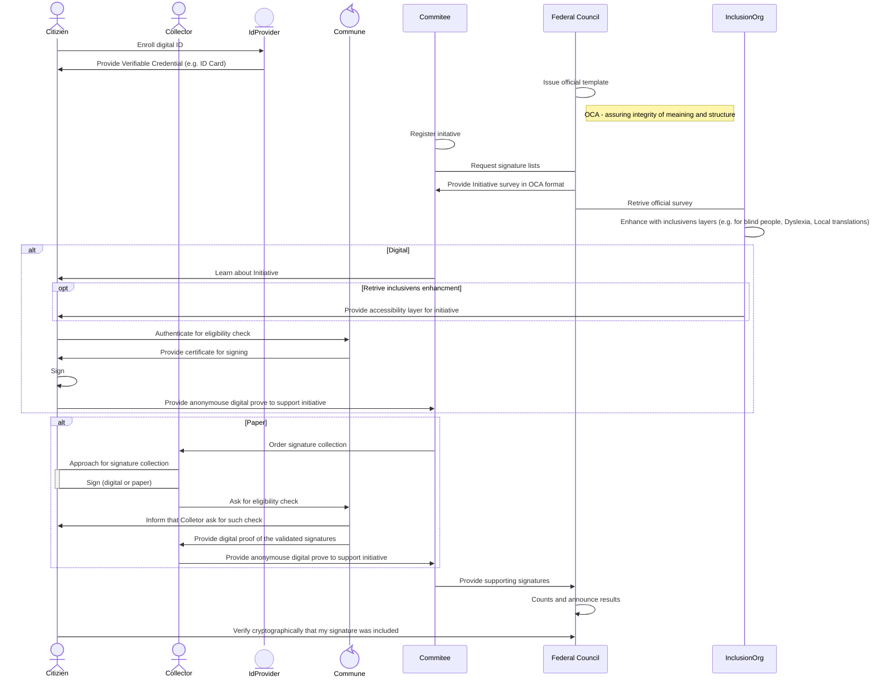
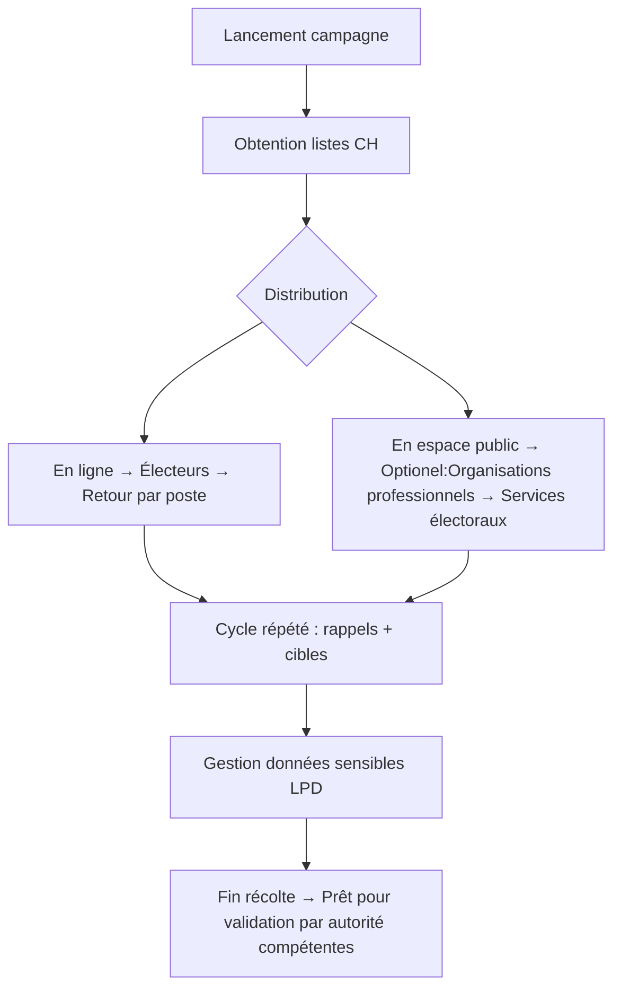

# Team 8. Instaurer la confiance à chaque signature ! Collecte électronique fédérée et vérifiée cryptographiquement
*(an english version can be found [here](https://github.com/the-human-colossus-foundation/e-collecting-hackathon-team8/blob/main/README_en.md))*
## Team 8 Contributeurs
| Membre  | Representant  | Organisation |
|---------|---------------|-------------|
| Philippe Page | *gouvernance distribuée* | [Human Colossus Foundation](https://humancolossus.foundation)|
| Robert Mitwicki | *technologies décentralisées* | [Human Colossus Foundation](https://humancolossus.foundation)|
| Jérôme Campese | *agence de récolte de signature* | [VOX Communication SA](https://www.vox-communication.ch/presentation) |
| Alessua Pacino | *canton de Thurgovie* | |
| Damian VIZÁR | *sécurité, cryptographie* | CSEM |
| Michał Pietrus | *identité numérique & cryptographie appliquée* | ArgonAuths |
  
### Références utilisées
1. [Récolte électronique des signatures à l'appui des initiatives populaires et des demandes de référendum au niveau fédéral](https://www.newsd.admin.ch/newsd/message/attachments/90668.pdf), Rapport du Conseil Fédéral, Novembre 2023
2. [Hackathon Guidelines](https://www.bk.admin.ch/bk/de/home/politische-rechte/e-collecting/aktuelles.html) Chancellerie Fédérale
3. Overlays Capture Architecture [OCA](https://oca.colossi.network/) specification
4. Distributed Key Managment System [DKMS](https://dkms.colossi.network/) specification

## Approche

### 1. Introduction
Notre approche repose sur l’adaptation des processus réglementaires existants à une architecture décentralisée et vérifiable. 

Durant la durée du hackathon, nous avons intéragi avec les experts présnents avec les compétences suivantes :
- Modélisation de processus réglementaires
- Expérience des systèmes communaux et cantonaux
- citoyens intéressé à la numérisation des services publiques
- agent de récolte de signature

#### Présentation de l'approche en 4 minutes 
*(vendredi 31 octobre)*

### 2. Description synthétique: Approche Fédérative et indépendent de plateforme unique
#### Périmètre du Hackathon: Phase 1
Nous proposons une approache par *petits pas significatifs* afin de s'assurer que l'évolution des normes (e.g. nombre de signatures à récolter) puisse s'adapter aux progrès technologiques.

| Phase  | But  | Description |
|---------|---------------|---- |
|1  |Numérisation essentielle| Le status quo n'est pas une option. Cette première phase, à mettre en place rapidement, se concentre donc sur les point clefs et introduit **une signature numérique pour le citoyen** et **améliore l'efficacité des contrôles**  tout en préservant le role des communes, cantons, comité d'initiatives et Chancellerie Fédérale.|
|2  |Feedback loop| Mesure de l'adoption des nouveautés et mesure de l'impact sociétal. *Ce sujet, bien que discuté durant le hackathon, n'est pas abordé ici*|
|3  |DDPI| Intégration du E-Collecting dans le concept plus large the Democratic Digital Public Infrastructure (DDPI). *Hors sujet pour le hackathon* |

Selon l'approche ci-dessus, seule la phase 1, **Numérisation essentielle** est inclue dans le champ de notre solution pour le hackathon.

#### Protocoles pour l'intégrité et l'autenticité des données
Notre solution vise à mettre en place une architecture décentralisée permettant à chaque acteur du processus de E-Collecting d'intéragir sans la nécessité d'une plateforme unique. Cette approche vise une intégration des systèmes des acteurs légitimes plutôt que la creation de platformes ou registres centralisé qui créent des dépendences envers différents acteurs technologiques, un risque de hacking (honey pot), et des coûts de déploiment. Deux innovations sont décrites ci-dessous:
A. Authenticité & Intégrité by Design
B. Gouvernance Distribuée

#### Documentation and Diagrams
#### A Authenticité et Intégrité *by-design*
We introduce a protocole based approach where open-source protocoles for authentication and data integrity are intégrated in the different components of an E-Collecting system. Collectively, they enable a digital verification architecture that can be used by any stakeholders in the process. 

This architecture is based on two open source components [DKMS](https://dkms.colossi.network/) (Decentralised Key Management System) for the authentication and [OCA](https://oca.colossi.network/) v2.0 (Overlays Capture Architecture), developed by the [Human Colossus Foundation](https://humancolossus.foundation/) for data integrity and harmonisation. These are two architectures are particularly well suited to digitising and securing civic processes while ensuring interoperability, transparency and verifiability.

The following diagramme describes how these architectures integrate into an E-Collecting system from identification of a stakeholder up to the specific applications/integration.

The technology stack (left column) rests on a digital identifiers layer that assumes multiple providers. The **"Identity Provider"** layer provide flexibility to integrate different mechanisms for identification depending on the use case. An example discussed during the hackathon refers to the *accessibility* where the identification for visually impaired individual will require specific mechanisms (e.g. biometric).

The **Protocol Layer** ensure security and harmonisation across the different authentication methods. 

The **Governance** layer is where the purpose of the use case is defined in terms of actors and data flows. In the Hackathon, we considered on specific use case of the E-Collection in the street as a benchmark use case. Other use cases can be developed without changing the underlying layers. This approach ensures interoperability between use cases and is well suited for a "Program Approach" where multiple projects can be developed independently. During the Hackathon, the case of applying E-Collecting for cantonal petition was elaborated for example.

The **Application Layer** is where the UX/UI is developed according to the use case defined in the Governance Layer. This ensures that context dependent application can be developed with the assurance that each is secured through the same governance and rest on the same authentication and integrity protocols. This approach has a significant cost impact as the security of the the system in terms of authentication and integrity is in the protocol and does not need to be redeveloped at the application layer. In technical terms, the approach is a paradigm shift from *Fat Application on Thin Protocols* to *Thin Application to Fat Protocols*

The architecture above provide a flexible framework to handel **Anonymity** and **Linkability**, the two main characteristics to consider when securing and protecting citizen privacy. It is well know that trade off between the two often occur. Within our layered approach, the two characteristics can be considered with a specific context. For E-Collecting, linkability is only needed between citizens and the commune. Anonymity between citizen and his commune reduces to the commune not recording the citizen support to an initiative/referandum longer than the strict minimum required. On the other hand anonymity should be in place for any other actors, who should not be able to discover citizen identity.  This is especially important for the Federal Council when counting votes.

Over the course of 2 days hackathon we worked with all [stakeholders](#sequence-diagram-details-des-interactions--flux-de-données) to reflect their requirments, governance and limitations. Below sequence diagram present possible scenario showcase how propsed architecture could improve e-collecting process, few highlights presented on the below diagram:

- Authentication (identification) process between the commune and citizen can be carried out using various ID providers (SwissPass, Swiss e-ID, passport, SwissSign, etc.). After this, the commune can issue a `one-time certificate` that can be used to digitally sign that specific initiative. This ensures that the citizen will not be linked in the subsequent stages of the process, while maintaining the audibility and cryptographic provability of the entire process.
- Introduction of additional notification mechanisms to inform citizens about eligibility checks and signatures included in initiatives. This increases security transparency and allows citizens to regain trust in the digital system. If someone tries to 'steal' their signature, they can opt-in a notification mechanism can informed them.
- `DKMS` to establish a distributed (digital) governance around the ecosystem and designate different parties which can be verified (as well as all the objects e.g. survey with content) during the process, for example:
  - Inclusive organisations, who can enrich existing initiatives with additional layers, e.g. local translation, improved text for people with ADHD, improved reading materials for blind people, and so on.
  - Collectors, so citizens can verify whether a collector is authorised to collect votes.
  - ID providers
  - Verify that the content which citizens are signing is actually registered for the initiative.
- The protocol-based approach enables each actor to define their own rules, facilitating integration with existing IT systems and reducing the costs and complexity of e-collection. This is particularly important in the context of various registries used to verify citizens and different parties within the ecosystem.

#### E-Signature in the street use case
We model and implement the digitization of the signature collection process, integrating:
- Digitization of signature collection in the street
- Real-time verification of electronic signatures by all actors
- Complementarity with “paper” solutions
Demonstrate the feasibility of a civic solution built on open, decentralized protocols
Highlight tangible benefits compared to paper-based or centralized systems
Reveal features exclusive to the digital version — notably, citizen-accessible proof of signature count

#### Collection process & artifacts.
The use case is describe in terms that will allow an in depth security analysis. These Hackaton notes sketches a notion of a scheme for electronic collection of signatures in supporting a referendum or an initiative.

The objective of such notion is to help define clear security requirements and assumptions, as well as to facilitate security analysis.

#### Notation
Parties denoted with **boldface**.
Artifacts denoted with *italics*.

#### Parties
1. **Committee**: Initiaties an initiative with the objective of collecting enough signatures to support it. 
2. **Chancellerie**: Validates the initiative, counts the signatures, attests the end result.
3. **Collectors**: Mandated by the Committee to collect signatures
4. **Voters**: Give their signatures to support the initiative
5. **Commune**: Verifies signatures (i.e. Voters eligibility) and ensures each Voter contributes at most once 

In addition, all parties except **Voters** have internal employees, denoted **XXX.Emp** where **XXX** is the party in question. The party **Commune** conflates Canton/Commune/Electoral committee for simplicity.

#### Process
In each party **XXX** with employees, each **XXX.Emp** that intervenes on an internal process of **XXX** receives a *Mandate* from **XXX**. The mandate may be role based, or task-based (a role specific to the initiative/batch of signatures etc.).

1. **Committee**: Creates and authenticates *Initiative* 
    * **Committee.Emps** contribute to the Initiative
2. **Chancellerie**: Verifies, approves and authenticates the  *Initiative*
    * Concrete **Chancellerie.Emps** perform the verification
3. **Committee**: Mandates **Collectors**  with the collections of *Support signatures* for the *Initiative* 
    * Inidividual mandates are issued by **Committee.Emps**
4. **Collectors**: Collect *Support signatures* for the *Initiative* from **Voters** and transfer them to **Committee**
    * Individual *Support signatures* are collected by concrete **Collector.Emps**
5. **Committee**: Send collected *Support signatures* to **Commune** for verification, in order to obtain *Signature certificates*
    * Verification and processing of signature (batches) could be performed by individual **Commune.Emps** but possibly also automatized
6. **Committee**: Obtains *Signature certificates* from the **Commune** and keeps track of the total count
7. **Chancellerie**: Obtains all collected *Signature certificates* from **Committee**, verifies them and if the count is sufficient, issues a *Confirmation of the initiative success*.
    * Verification and processing of signature (batches) could be performed by individual **Chancellerie.Emps** but possibly also automatized

#### Artifacts
The artifacts highlighted in the process may be constructed in many ways, depending on the construction. Additional, auxiliary artifacts may be used if needed, but those above shall be embodied in any distributed construction that aligns with the existing governance structures and procedures.
1. *Initiative*: Initiative for which **Voters** support is asked.
2. *Support signatures*: Set of support of **Voters** including mandatory attributes (name, address,signature,...) for each **Voters**. Support is collected asynchronously and are bundled together. **Commune** is the atomic unit (i.e. each signature list contains individual signatures of the same **Commune**
3. *Signature certificates*: Certifies the eligibility and unicity of individual **Voters** in one or more *Support signatures* of a specific **Commune**
4. *Confirmation of the initiative success*: is the certificate issued by the Chancellor in case of success. This artifact, or its absence after a define time limit, triggers sub-processes (e.g.  *Support signatures* destruction, launch popular vote) that terminate the support signature collection process.

The process is represented in the following sequence diagramme

A preliminary draft of a security analysis is provided [here for illustration purposes](https://github.com/the-human-colossus-foundation/e-collecting-hackathon-team8/blob/main/SecurityAnalysis_v01.pdf).

#### B. Gouvernance Distribuée *by-design*
For the Governance Layer, we apply a digital distributed governance model that avoids the need of creating a centralised platform outside the control of a legitimate authority (e.g no data stored unless already provision in the law). 

A very simplified flow chart is

#### Sequence Diagram: Details des interactions & Flux de données
Le processus de collecte des signatures pour les initiatives et les référendums est décrit dans le rapport du Conseil fédéral (réf. AAA).
Il implique les acteurs suivants :
| 🎯 Acteur                      | 📝 Description                                                                 | 📜 Base légale / Notes                                     | 🛠️ Responsabilités dans la phase de récolte             |
|-------------------------------|--------------------------------------------------------------------------------|------------------------------------------------------------|----------------------------------------------------------|
| **Comité**                    | Comité lançant l’initiative populaire ou la demande de référendum. Gère la campagne, la logistique et le traitement des données. | Art. 60a, 69a LDP (listes) ; LPD Art. 5c (protection des données) | Diffuser les listes, engager des collecteurs, respecter la finalité des données |
| **Électeurs**                 | Citoyens suisses qui signent les listes. Leurs données sont sensibles selon la LPD. | LPD Art. 5c (données sensibles) ; principe de finalité     | Renvoyer les listes signées (par la poste ou en personne) |
| **Organisations professionnelles**         | Organismes professionnels engagés pour récolter des signatures ou obtenir des attestations. | En cours de réglementation (soupçons de falsification)      | Récolter en espace public ; obtenir les attestations d’électeur |
| **Chancellerie fédérale (CH)** | Autorité fédérale qui met à disposition les listes de signatures téléchargeables. | Art. 60a, 69a LDP                                          | Fournir les formulaires — *non impliquée dans la récolte* |
| **Services électoraux**       | Services cantonaux ou communaux gérant les registres électoraux.               | Droit cantonal (vérification de l’éligibilité)             | Délivrer les attestations d’électeur aux collecteurs     |
| **Cantons/Communes (CC)**     | Autorités locales régulant l’utilisation de l’espace public pour la récolte.   | Droits fondamentaux (Art. 5, 10, 35 Cst.)                  | Autoriser l’utilisation de l’espace public sous conditions |

**Diagramme de séquences**

## UX/UI expérience utilisateur
Bien que notre approche ne traite pas directement de l'expérience utilisateur, elle a un impact significatif sur la conception de l'expérience utilisateur. En effet, l'approche basée sur un protocole permet de développer des applications ou des intégrations adaptées aux besoins spécifiques de chaque partie prenante sans compromettre l'interopérabilité. 

Par exemple, une organisation indépendante pourrait développer une application de référendum adaptée aux personnes aveugles, leur permettant de participer plus facilement à l'initiative. De même, les personnes incapables de signer pourraient utiliser une application dédiée avec reconnaissance faciale à des fins d'identification, réduisant ainsi les obstacles à la participation. Le protocole SMPT a également permis la mise en place de diverses solutions pour les clients et serveurs de messagerie électronique sur Internet, et DKMS fait de même ici. Cela permet la création d'un écosystème riche et stable, résilient et capable de répondre aux besoins de toutes les parties (sans verrouillage des fournisseurs).

## Sujets abordés
L'équipe 8, « Trust for every signature » (Confiance pour chaque signature), a abordé les 10 sujets présentés dans les [lignes directrices](https://www.bk.admin.ch/bk/de/home/politische-rechte/e-collecting/aktuelles.html).

| Protocole  | Nom  | Propriété |
|-------|-------------|---------|
|**Intégrité**|**OCA**|**Architecture de capture des superpositions**|
||Base de capture stable| Permet d'appliquer des définitions d'extension et de coloration dans les superpositions. Les émetteurs peuvent ainsi modifier un ou plusieurs objets liés pour créer des mises à jour simples plutôt que de réémettre en permanence des bases de capture. Cette propriété s'avère essentielle dans un système fédéral qui doit capturer les nuances cantonales sur une base commune|
||Mise en commun simplifiée des données|Le découplage peut se produire à tout moment, car les superpositions sont des objets liés. Toutes les définitions de coloration étant stockées dans les superpositions, la combinaison des données provenant de sources connexes devient transparente|
||Axé sur le contenu|Les objets immuables soutenus par des identifiants auto-adressables (SAID) liés cryptographiquement au contenu garantissent la sécurité et la portabilité|
||Attributs signalés|Les émetteurs peuvent signaler les attributs de la base de capture qui pourraient potentiellement révéler l'identité d'une entité gouvernementale|
||Présentation des informations d'identification|Prise en charge de la présentation flexible des informations d'identification, de manière sécurisée et contrôlée|
||Internationalisation|Un objet de données lié distinct capture les définitions d'encodage des jeux de caractères. Ainsi, une seule définition de rapport peut contenir différentes formes d'attributs pour différentes langues|
||Validation des données|Garantir que les enregistrements de données capturés sont conformes au schéma OCA bundle|
||||
|**Authenticité**|**DKMS**|**Système de gestion des clés distribuées**|
||Identifiants stables|*Changement DKMS — faire confiance aux identifiants, pas aux clés :* déplacer la confiance de la **clé** vers un **identifiant stable**, afin que les clés et les suites cryptographiques (par exemple, post-quantum) puissent évoluer sans compromettre l'intégrité.|
||Systèmes d'identité multiples|Prévoir de nombreux systèmes d'identité à différents niveaux (par exemple, identité nationale, identité cantonale, identité citoyenne, etc.), nécessitant une **couche de compatibilité** entre eux. Concevoir des **systèmes d'identité parallèles** (nationaux, cantonaux, etc.)|
||Vérification à long terme|Les PKI actuelles reposent sur des **clés à durée de vie courte et renouvelables**. Les compromissions de racine entraînent des **révocations massives**, ce qui fragilise la vérification dans le temps et entre les juridictions.|
||Post-quantum readyness|Pre-rotation mechanism|
||Privacy-capable interoperability|Use **open protocols** (not a central authority) to include diverse ID systems,|
||Privacy-preserving cryptography|choosing cryptography that supports **privacy-preserving features** like *selective disclosure* and *zero-knowledge proofs*.|
||Multi-Signature Mechanism|Ability to support multiple digital signatures defined by a treshold mechanism.|
||||
||||
|**Legitimity**|**Distributed Governance**||
||Digital Sovereignty|Digital Technologies have a tendency to centralise and simplify human relations. This limits and harm the possibility of aligning digital tools to local context and rules. A legitimate-actor-first approach is the extension of Self-Sovereign Identity principles from individuals to ecosystems|
||Federated Governance|Allow **layered governance**, enabling each entity to define, within its jurisdictional scope, its own rules.|

## **Thème 1 — De la volonté de soutenir → à la soumission (UX et confiance)**
Introduire des outils de vérification numérique pour les « électeurs » et les « collecteurs ». 
*Authentification avancée pour l'identification : qui est qui ?* Identification sans ambiguïté des « électeurs » et des « collecteurs ».
*Harmonisation et intégrité des données* Assurance cryptographique du contenu. Harmonisation entre les langues et les formats.
*Gouvernance distribuée : qui est légitime ?* Preuve de la légitimité des « collecteurs ». Traçabilité et responsabilité des « employés collecteurs ».

## **Thème 2 — Accès à des informations actualisées sur les aides soumises (transparence)**
Un accès vérifiable à l'information, **indépendamment de son origine**, est essentiel pour tous les acteurs. L'accessibilité des citoyens pour les personnes handicapées peut être considérablement améliorée dans l'espace numérique grâce à de multiples mises en œuvre — écrites, vocales ou vidéo — d'un système **inclusif** mais **vérifiable**.
Afin de garantir la vérifiabilité sans sacrifier l'ouverture, les données en circulation doivent être sécurisées, en particulier compte tenu des multiples canaux et intermédiaires impliqués. Cela répond au double besoin d'anonymat et de traçabilité, le cas échéant. Un flux de travail numérique peut rationaliser le processus.

Les communes et les cantons pourraient conserver les formulaires de signature papier jusqu'à ce que la Chancellerie leur donne officiellement l'ordre de les détruire. Le devoir du comité de rassembler et de soumettre à la Chancellerie la liste complète des signataires de l'initiative peut être préservé, mais sous forme numérique, tout en conservant son droit de mettre fin prématurément à une initiative.

Le défi principal reste le même : comment repenser le dépôt cérémoniel des initiatives à Berne à l'ère numérique ?

## **Thème 3 — Conditions de fonctionnement des comités et écosystème de collecte**
Dans l'approche proposée, la distinction entre les initiatives et les référendums est faite au niveau de la gouvernance. Ainsi, dans le cas d'un référendum, la principale différence serait que N>1 « comité » leur fournirait un certificat de soutien. Ce thème est donc, du point de vue de la numérisation, très similaire au thème 1.

*Authentification avancée pour l'identification : qui est qui ?* La **provenance des données** intégrée garantit la traçabilité et la conformité.
*Harmonisation et intégrité des données* Harmonisation des différentes entrées numériques provenant de divers canaux
*Gouvernance distribuée : qui est légitime ?* Gouvernance fédérée

## **Thème 4 — Présentation des arguments des comités via la collecte électronique**
Ce thème est particulièrement bien traité par l'architecture OCA (Overlays Capture Architecture). L'architecture prend en charge différentes présentations cryptographiques liées à des modèles approuvés ou à des ressources originales. Cela garantit un haut degré de vérifiabilité par tout acteur auquel un tel document est présenté par voie électronique.
L'OCA est particulièrement pertinente pour concevoir des solutions de présentation spécifiques aux personnes handicapées tout en maintenant un haut niveau de sécurité.
Les protocoles qui garantissent l'**authenticité et l'origine** des arguments dans un environnement **multilingue** et **multiformat** (numérique et physique) réduisent le risque de **fausse présentation**.

*Authentification avancée pour l'identification : qui est qui ?* Systèmes multi-identités intégrés, traçabilité.
*Harmonisation et intégrité des données* Toutes les fonctionnalités de l'OCA
*Gouvernance distribuée : qui est légitime ?* Registres des originaux et des modèles approuvés

## **Thème 5 — Exclusion des aides illégales (éligibilité, doublons, authenticité)**
Une **approche basée sur un protocole** offre une certaine flexibilité sans imposer un modèle unique. Dans les systèmes numériques, la **cryptographie** est le seul moyen de défense fiable contre :

* les signatures falsifiées
* les soumissions en double
* les violations de l'authenticité

*Authentification avancée pour l'identification : qui est qui* Pour construire un **système durable**, la **souplesse cryptographique** est essentielle — elle permet de remplacer les clés compromises sans perturber l'ensemble du réseau. Un **mécanisme de révocation et de récupération** robuste est indispensable à la durabilité de l'écosystème. Différents cas d'utilisation nécessitent différentes techniques :
* **Preuves à divulgation nulle de connaissance** pour la vérification préservant la confidentialité
* **Divulgation sélective** ou **signatures de vérificateurs désignés** pour la protection contre l'utilisation abusive des signatures

*Harmonisation et intégrité des données* garantissant l'**intégrité des documents** dans tous les formats et toutes les langues.

## **Thème 6 — Prévenir la suppression (perte/rétention) des soutiens**

La **transparence totale du processus** grâce à des **mécanismes de confirmation (reçus)** permet aux deux parties de vérifier les actions :

* Le collecteur peut prouver qu'une signature a été reçue.
* Le signataire peut prouver que son soutien a été soumis dans un but précis.

La vérification est un vecteur de confiance qui permet à chacun de vérifier ses contributions et de contrôler celles des autres. Cela nous permet de regagner la confiance dans les systèmes numériques et de rendre l'ensemble de la solution plus résistante à la manipulation. La sécurisation des informations au niveau du protocole permet à la solution d'atteindre cet objectif sans compromettre l'interopérabilité. La conception de DKMS permet d'introduire des observateurs dans le processus, ce qui ajoute un niveau de sécurité supplémentaire. Cela s'apparente à la manière dont les observateurs sont utilisés dans les processus papier dans la vie réelle.

*Authentification avancée pour l'identification : qui est qui* **traçabilité**, tandis que la **conception sans plateforme** élimine les points centraux de défaillance ou d'attaque. Des **journaux d'événements** doivent exister au **niveau du protocole** pour l'interopérabilité et la notification, permettant aux signataires de confirmer que leur vote a été pris en compte, même à distance ou par courrier.

## **Thème 7 — Préserver la confidentialité et la vie privée**
La vérification établit des **vecteurs de confiance**, essentiels à la transparence et à la responsabilité.
Les technologies numériques introduisent une **cryptographie puissante qui renforce la confidentialité**, mais nécessitent une **agilité cryptographique** pour choisir l'outil adapté à chaque cas.

Une **approche basée sur des protocoles** et ancrée sur des **identifiants** (et non des clés) permet l'interopérabilité entre des écosystèmes ayant des normes de confidentialité différentes.

De plus, l'introduction de la non-liabilité dans le processus après que le citoyen a interagi pour vérifier son éligibilité permet de protéger l'identité des utilisateurs après la signature d'une initiative.

*Authentification avancée pour l'identification :*  les **échanges préservant la confidentialité** dépendent de mécanismes vérifiables qui garantissent la confiance dans *qui a fait quoi* et *ce qui a été vérifié*.
*Harmonisation et intégrité des données* : **minimisation des données**

## **Topic 8 — Integration with Paper Processes (Hybrid Operation)**

**Paper** remains a trusted, simple, and inclusive medium. Integration with paper-based processes is essential for **inclusivity** and **adaptability** — digital systems should **enhance**, not replace, paper workflows. 

Authentication and integrity protocols allow digitally enhanced papers to be produced, which increase security and address various forms of misuse and forgery that have led to recent scandals. 

A **protocol-based approach** supports this inclusivity, enabling hybrid configurations:

* Fully digital
* Fully paper-based
* Mixed or transitional setups

Baseline protocols ensure all combinations remain **interoperable and verifiable**.
## **Thème 9 — Adoption facile par les municipalités et gains d'efficacité (utilisation des infrastructures existantes)**

Les communes/cantons diffèrent en termes de ressources et de modèles de services publics numériques (par exemple, Genève centralise les registres) :
Certaines peuvent adopter immédiatement des systèmes numériques avancés, tandis que d'autres doivent **intégrer progressivement** de nouveaux processus.

La sécurité doit rester cohérente dans toutes les entités.
Commencer par des **processus améliorés sur papier** offre un moyen peu risqué de **renforcer la confiance** entre les citoyens et les organisations.

Une **approche basée sur des protocoles** permet à chaque municipalité de **choisir l'outil adapté** à son contexte, en prenant en charge plusieurs implémentations sous la même base sécurisée et vérifiable. Les protocoles peuvent être intégrés dans les solutions existantes.

## **Thème 10 — Collecte électronique pour tous les niveaux fédéraux**

Sécuriser les données plutôt que leur emplacement facilite l'échange de données, non seulement pour collecter des informations provenant de diverses sources, mais aussi pour créer une chaîne de provenance des données à des fins de vérifiabilité. Une approche d'architecture zéro confiance basée sur des protocoles permet des connexions simples et complexes entre les autorités à différents niveaux d'avancement technologique. Cela réduit les coûts et donne accès aux informations uniquement aux utilisateurs autorisés, qui peuvent être régis à la fois par des approches ascendantes et descendantes, ce qui permet une plus grande flexibilité.
## Principaux atouts et faiblesses

### Principaux atouts
- Minimisation et sécurité des données en mouvement.
- Les protocoles décentralisés renforcent l'interopérabilité sans compromettre la sécurité.
- L'absence de plateforme réduit le risque de défaillance (il n'y a pas de point de défaillance unique).
- Il est possible de réduire les coûts et les délais de mise sur le marché pour le processus de développement multipartite.
  
### Faiblesses
- Une nouvelle approche entraîne des obstacles à l'adoption en raison d'un manque de compréhension. 
- Un système plus complexe impliquant davantage de composants.

## Projet pilote
Au cours du hackathon, de nombreuses caractéristiques d'un projet pilote idéal ont été discutées.
Nous suggérons de mener un projet pilote avec un consortium de parties prenantes afin de démontrer les avantages de la technologie et d'identifier les défis potentiels qui pourraient survenir lors des tests dans le monde réel. Le consortium devrait être composé :
- d'organisations qui collectent des signatures dans la rue ;
- d'une organisation inclusive ;
- d'au moins deux fournisseurs d'identité ;
- d'au moins deux communes ;
- d'au moins deux cantons ;
- d'experts en cryptographie ;
- de fournisseurs de solutions informatiques pour les systèmes informatiques des communes/cantons (faisabilité de l'intégration) ;
- du Conseil fédéral.

- Les initiatives étant un sujet très sensible, nous suggérons de mener un projet pilote incluant :
- Une population représentative de cantons et de communes afin de garantir la scalabilité de la solution et d'évaluer l'impact financier sur les communautés locales,
- L'accessibilité. Au moins un ou deux handicaps doivent être pris en compte dans la conception initiale. L'inclusivité n'est pas un simple ajout,
- Une pétition pour démarrer rapidement. Le fait d'inclure la collecte de signatures pour la pétition comme première étape pourrait permettre de bien préparer un projet pilote à grande échelle d'initiatives nationales. 

## Licence
Tous les documents contenus dans ce référentiel sont soumis à une licence EUPL1.2. Pour plus d'informations, consultez le fichier [LICENCE](LICENCE).

Alle Materialien in diesem Repository unterliegen einer EUPL1.2-Lizenz – Einzelheiten finden Sie in der Datei [LICENSE](LICENSE).

Tutti i materiali presenti in questo archivio sono concessi in licenza ai sensi della licenza EUPL1.2. Per ulteriori dettagli, consultare il file [LICENZA](LICENZA).

Ĉiuj materialoj en ĉi tiu deponejo estas licencitaj laŭ EUPL1.2-licenco - vidu la dosieron [LICENSE](LICENSE) por detaloj.

Tous les documents contenus dans ce référentiel sont concédés sous licence EUPL1.2. Pour plus de détails, consultez le fichier [LICENCE](LICENCE).
