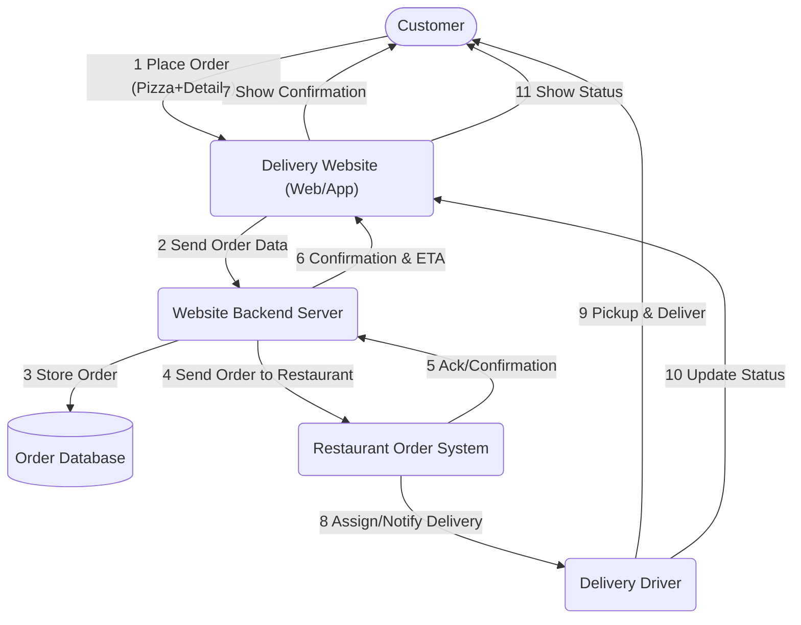
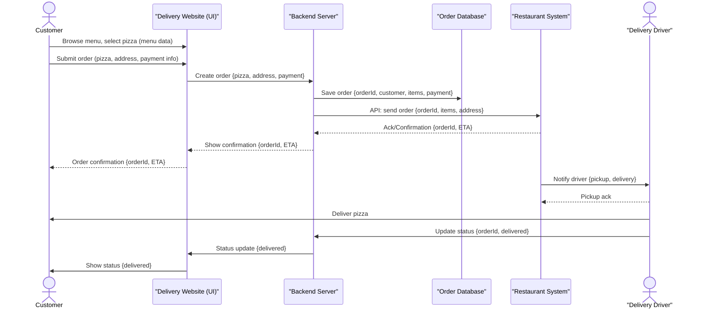

# 8) Instaurer la confiance à chaque signature ! Collecte électronique fédérée et vérifiée cryptographiquement

*Over the course of two days, you will develop your solution for collecting electronic signatures for popular initiatives and referendums from A to Z, addressing the 10 topics outlined in the [guidelines](https://www.bk.admin.ch/bk/de/home/politische-rechte/e-collecting/aktuelles.html). Your prototype can be conceptual, clickable, and/or technical. Either way, you should clearly present the interactions and data flows between actors, software, and infrastructure components over time, as well as the user experience of these actors.*

## Approach

*A brief description of your approach, a link/reference to the detailed description of your approach and what you have already created (if applicable). Please also mention which skills you need for your team.*

## Documentation and Diagrams

*Together, you will contribute to comparing different ways of how to implement e-collecting in Switzerland from A to Z. As part of the [participatory process](https://www.bk.admin.ch/bk/de/home/politische-rechte/e-collecting/partizipativer_prozess.html), your solutions will be discussed in subsequent workshops and will possibly be taken into account for the official decision on the design of the federal e-collecting trials. Proper documentation is key to ensuring that your solution can be understood and evaluated:*

1. **[Mermaid](https://mermaid.js.org/) diagram(s) showing interactions and data flows between actors, software and infrastructure components of your solution over time.**
2. **Wireframes or mockups with user flow showing the user experience of different actors** (using e.g. Figma)
3. Explain how you addressed the topics presented in the [guidelines](https://www.bk.admin.ch/bk/de/home/politische-rechte/e-collecting/aktuelles.html), filling in the template below.
4. List the key strengths and weaknesses of your solution.
5. Explanation of features used (if applicable)
6. A requirements file with all packages and versions used (if applicable)
7. Environment code to be run (if applicable)

*For your reference, you will find below an example of two diagrams showing interactions and data flows between actors, software and infrastructure components of ordering a pizza via a third-party delivery website over time. Please replace them with diagrams for your solution.*

### Flowchart: High-level Process (Example)

*An overall process flow showing the main steps and system/actor interactions for ordering a pizza online via a delivery website, including software, infrastructure, and handoff to the restaurant and delivery driver.*

### Sequence Diagram: Detailed Interactions & Data Flows (Example)

*A step-by-step illustration showing how data and requests are exchanged between actors (customer, delivery site, restaurant, infrastructure), and key software components in the order process.*

## User Experience

*Add or reference wireframes or mockups with user flow showing the user experience of different actors.*

## Topics addressed
L'équipe 8 *Confiance pour chaque signature" abordéra les 10 thèmes présentés dans les [directives](https://www.bk.admin.ch/bk/de/home/politische-rechte/e-collecting/aktuelles.html). La table ci-dessous identifié l'approche:
- *Gouvernance:* Quelles règles définissent le système
- *Data:* Comment la définission et l'intégrité des données est-elle assurée.
- *Tech.:* Quelles inovations technologiques nous allons introduire
En fonction de l'avancement du hackathon, des liens seront ajouté pour donner plus de détails.

*Explain how you addressed the topics presented in the [guidelines](https://www.bk.admin.ch/bk/de/home/politische-rechte/e-collecting/aktuelles.html), filling in the template below.*

| Topic | (How) is it addressed? |c.f. Cas d'étude|
| -| ------- |---- |
| 1 « De la volonté de soutien à la déclaration de soutien »| *Gouvernance:* ...||
|| *Data:* ...||
||**Tech. perspective:** Authentication décentralisée||
| 2 « Accès aux informations concernant les déclarations de soutien déposées » | *Gouvernance:* ...||
|| *Data:* ...||
||**Tech. perspective:** ... ||
| 3 « Attribution des attestations de soutien aux comités et aux entreprises de récolte »| *Gouvernance:* ...||
|| *Data:* ...||
||**Tech. perspective:** ...  ||
| 4 « Diffusion des arguments des comités via le logiciel de récolte électronique de signatures » | *Gouvernance:* ...||
|| *Data:* ...||
||**Tech. perspective:** ...  ||
| 5 « Exclusion des attestations de soutien illicites »  |*Gouvernance:* ...||
|| *Data:* ...||
||**Tech. perspective:** ...   ||
| 6 « Prévention des attestations de soutien non dépouillées »  | *Gouvernance:* ...||
|| *Data:* ...||
||**Tech. perspective:** ...  ||
| 7 « Respect du secret du vote »  |*Gouvernance:* ...||
|| *Data:* ...||
||**Tech. perspective:** ...   ||
| 8 « Intégration avec le processus papier »  |*Gouvernance:* ...||
|| *Data:* ...||
||**Tech. perspective:** ...   ||
| 9 « Introduction facilitée pour les communes avec un gain d'efficacité ; sur la base des
infrastructures et des processus existants »  | *Gouvernance:* ...||
|| *Data:* ...||
||**Tech. perspective:** ...  ||
| 10 « Récolte électronique pour tous les niveaux fédéraux »  | *Gouvernance:* ...||
|| *Data:* ...||
||**Tech. perspective:** ...  ||

## Points forts et faiblesses (*Key Strenghts and Weaknesses*)

*List the key strengths and weaknesses of your solution.*

### Points forts:
(*Key strenght*)
- ...
- ...

### Faiblesses:
(*Weaknesses*)
- ...
- ...

## Getting Started  (*prochaine mise à jour vendredi*)

*These instructions will get you a copy of the technical prototype (if applicable) up and running on your local machine for development and testing purposes. **If you are not developing a technical prototype, please present or reference your conceptual and/or clickable prototype.***

### Conditions préalables
*Ce dont vous avez besoin pour commencer.*
Nous formons une équipe multidisciplinaire. 
- Citoyen 
- Cantons et communes
- Initiateur d'une initiative / d'un référendum
- Chancellerie fédérale
- Développeur de solutions
La condition préalables principale est la volonté de poser des questions afin de construire une solution les prenant en compte.

### Installation (*prochaine mise à jour vendredi*)
*Une série d'exemples étape par étape qui expliquent comment mettre en place l'environnement de développement.*
*A step by step series of examples that tell you how to get a development env running.*
*What things you need to install the software and how to install them.*

## Contribution & Code de conduite
Veuillez lire [CONTRIBUTING.md](/CONTRIBUTING.md) pour plus de détails sur notre code de conduite.

## Team Members

- Philippe Page (*gouvernance digitale*)
- Robert Mitwicki (*technologies décentralisées*)
- Damian VIZÁR (*sécurité, cryptographie*)
- *Contactez Philippe Page <philippe.page@humancolossus.org> si vous voulez rejoindre l'équipe 8*
- *Wenden Sie sich an Philippe Page <philippe.page@humancolossus.org>, wenn Sie dem Team 8 beitreten möchten.*
- *Contatta Philippe Page <philippe.page@humancolossus.org> se desideri entrare a far parte del team 8*

## License

Tous les documents contenus dans ce référentiel sont soumis à une licence EUPL1.2. Pour plus d'informations, consultez le fichier [LICENCE](LICENCE).

Alle Materialien in diesem Repository unterliegen einer EUPL1.2-Lizenz – Einzelheiten finden Sie in der Datei [LICENSE](LICENSE).

Tutti i materiali presenti in questo archivio sono concessi in licenza ai sensi della licenza EUPL1.2. Per ulteriori dettagli, consultare il file [LICENZA](LICENZA).

Ĉiuj materialoj en ĉi tiu deponejo estas licencitaj laŭ EUPL1.2-licenco - vidu la dosieron [LICENSE](LICENSE) por detaloj.

All materials under this repository is licensed under a EUPL1.2 License - see the [LICENSE](LICENSE) file for details.

