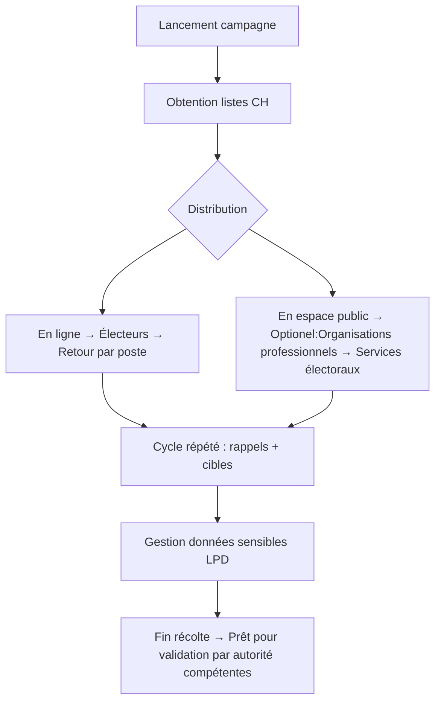

# 8) Instaurer la confiance à chaque signature ! Collecte électronique fédérée et vérifiée cryptographiquement

*Over the course of two days, you will develop your solution for collecting electronic signatures for popular initiatives and referendums from A to Z, addressing the 10 topics outlined in the [guidelines](https://www.bk.admin.ch/bk/de/home/politische-rechte/e-collecting/aktuelles.html). Your prototype can be conceptual, clickable, and/or technical. Either way, you should clearly present the interactions and data flows between actors, software, and infrastructure components over time, as well as the user experience of these actors.*

## Approche
### 1. Introduction
Notre approche repose sur l’adaptation des processus réglementaires existants à une architecture décentralisée et vérifiable. Pour plus de détails, consultez notre documentation complète (à compléter) et les livrables déjà produits (le cas échéant).

Nous recherchons des contributeurs avec des compétences en :
- Modélisation de processus réglementaires
- Expérience des systèmes communaux et cantonaux
- citoyens intéressé à la numérisation des services publiques
- 

### 2. Description synthétique

Notre solution s’appuie sur les architectures open source DKMS (Decentralised Key Management System) et OCA v2.0 (Overlays Capture Architecture), développées par la fondation Human Colossus, pour numériser et sécuriser les processus civiques tout en garantissant la transparence et la vérifiabilité.

#### Étape 1 : Cas d’usage — Collecte de signatures en milieu physique
Nous modélisons et implémentons la numérisation du processus de collecte de signatures, en intégrant :
- L’authentification des citoyens via des identités décentralisées
- La vérification en temps réel des signatures
- L’enregistrement immuable des données

#### Étape 2 : Analyse des 10 thèmes du Hackathon
Nous évaluons chaque thème en identifiant :
- Les avantages apportés par notre solution (transparence, traçabilité, inclusion)
- Les risques potentiels (accessibilité, adoption, conformité réglementaire)

Objectifs de ces deux étapes :
1. Démontrer la faisabilité d’une solution civique basée sur des protocoles ouverts et décentralisés
2. Mettre en évidence les bénéfices concrets par rapport aux systèmes papier ou centralisés
3. Révéler des fonctionnalités exclusives à la version numérique — notamment, une preuve de comptage de signatures accessible au citoyen

## Documentation and Diagrams

*Together, you will contribute to comparing different ways of how to implement e-collecting in Switzerland from A to Z. As part of the [participatory process](https://www.bk.admin.ch/bk/de/home/politische-rechte/e-collecting/partizipativer_prozess.html), your solutions will be discussed in subsequent workshops and will possibly be taken into account for the official decision on the design of the federal e-collecting trials. Proper documentation is key to ensuring that your solution can be understood and evaluated:*

1. **[Mermaid](https://mermaid.js.org/) diagram(s) showing interactions and data flows between actors, software and infrastructure components of your solution over time.**
2. **Wireframes or mockups with user flow showing the user experience of different actors** (using e.g. Figma)
3. Explain how you addressed the topics presented in the [guidelines](https://www.bk.admin.ch/bk/de/home/politische-rechte/e-collecting/aktuelles.html), filling in the template below.
4. List the key strengths and weaknesses of your solution.
5. Explanation of features used (if applicable)
6. A requirements file with all packages and versions used (if applicable)
7. Environment code to be run (if applicable)

*For your reference, you will find below an example of two diagrams showing interactions and data flows between actors, software and infrastructure components of ordering a pizza via a third-party delivery website over time. Please replace them with diagrams for your solution.*

###  Desciption générale des processus selon la réglementation en vigeure
### 1 Lancement D'initiative populaires et demande de référendum
*à faire*

### 2 Collecte des signature
#### Flow chart

#### Sequence Diagram: Details des interactions & Flux de données
Le processus de collecte des signatures pour les initiatives et les référendums est décrit dans le rapport du Conseil fédéral (réf. AAA).
Il implique les acteurs suivants :
| 🎯 Acteur                      | 📝 Description                                                                 | 📜 Base légale / Notes                                     | 🛠️ Responsabilités dans la phase de récolte             |
|-------------------------------|--------------------------------------------------------------------------------|------------------------------------------------------------|----------------------------------------------------------|
| **Comité**                    | Comité lançant l’initiative populaire ou la demande de référendum. Gère la campagne, la logistique et le traitement des données. | Art. 60a, 69a LDP (listes) ; LPD Art. 5c (protection des données) | Diffuser les listes, engager des collecteurs, respecter la finalité des données |
| **Électeurs**                 | Citoyens suisses qui signent les listes. Leurs données sont sensibles selon la LPD. | LPD Art. 5c (données sensibles) ; principe de finalité     | Renvoyer les listes signées (par la poste ou en personne) |
| **Organisations professionnelles**         | Organismes professionnels engagés pour récolter des signatures ou obtenir des attestations. | En cours de réglementation (soupçons de falsification)      | Récolter en espace public ; obtenir les attestations d’électeur |
| **Chancellerie fédérale (CH)** | Autorité fédérale qui met à disposition les listes de signatures téléchargeables. | Art. 60a, 69a LDP                                          | Fournir les formulaires — *non impliquée dans la récolte* |
| **Services électoraux**       | Services cantonaux ou communaux gérant les registres électoraux.               | Droit cantonal (vérification de l’éligibilité)             | Délivrer les attestations d’électeur aux collecteurs     |
| **Cantons/Communes (CC)**     | Autorités locales régulant l’utilisation de l’espace public pour la récolte.   | Droits fondamentaux (Art. 5, 10, 35 Cst.)                  | Autoriser l’utilisation de l’espace public sous conditions |

**Diagramme de séquences**

## User Experience

*Add or reference wireframes or mockups with user flow showing the user experience of different actors.*

## Topics addressed
L'équipe 8 *Confiance pour chaque signature" abordéra les 10 thèmes présentés dans les [directives](https://www.bk.admin.ch/bk/de/home/politische-rechte/e-collecting/aktuelles.html). La table ci-dessous identifié l'approche:
- *Gouvernance:* Quelles règles définissent le système
- *Data:* Comment la définission et l'intégrité des données est-elle assurée.
- *Tech.:* Quelles inovations technologiques nous allons introduire
En fonction de l'avancement du hackathon, des liens seront ajouté pour donner plus de détails.

*Explain how you addressed the topics presented in the [guidelines](https://www.bk.admin.ch/bk/de/home/politische-rechte/e-collecting/aktuelles.html), filling in the template below.*

| Topic | (How) is it addressed? |c.f. Cas d'étude|
| -| ------- |---- |
| 1 « De la volonté de soutien à la déclaration de soutien »| *Gouvernance:* ...||
|| *Data:* ...||
||**Tech. perspective:** Authentication décentralisée||
| 2 « Accès aux informations concernant les déclarations de soutien déposées » | *Gouvernance:* ...||
|| *Data:* ...||
||**Tech. perspective:** ... ||
| 3 « Attribution des attestations de soutien aux comités et aux entreprises de récolte »| *Gouvernance:* ...||
|| *Data:* ...||
||**Tech. perspective:** ...  ||
| 4 « Diffusion des arguments des comités via le logiciel de récolte électronique de signatures » | *Gouvernance:* ...||
|| *Data:* ...||
||**Tech. perspective:** ...  ||
| 5 « Exclusion des attestations de soutien illicites »  |*Gouvernance:* ...||
|| *Data:* ...||
||**Tech. perspective:** ...   ||
| 6 « Prévention des attestations de soutien non dépouillées »  | *Gouvernance:* ...||
|| *Data:* ...||
||**Tech. perspective:** ...  ||
| 7 « Respect du secret du vote »  |*Gouvernance:* ...||
|| *Data:* ...||
||**Tech. perspective:** ...   ||
| 8 « Intégration avec le processus papier »  |*Gouvernance:* ...||
|| *Data:* ...||
||**Tech. perspective:** ...   ||
| 9 « Introduction facilitée pour les communes avec un gain d'efficacité ; sur la base des
infrastructures et des processus existants »  | *Gouvernance:* ...||
|| *Data:* ...||
||**Tech. perspective:** ...  ||
| 10 « Récolte électronique pour tous les niveaux fédéraux »  | *Gouvernance:* ...||
|| *Data:* ...||
||**Tech. perspective:** ...  ||

### 3 Vérification des signature et soumission à la Chancellerie Fédérale
*à faire*

## Points forts et faiblesses (*Key Strenghts and Weaknesses*)

*List the key strengths and weaknesses of your solution.*

### Points forts:
(*Key strenght*)
- ...
- ...

### Faiblesses:
(*Weaknesses*)
- ...
- ...

## Getting Started  (*prochaine mise à jour vendredi*)

*These instructions will get you a copy of the technical prototype (if applicable) up and running on your local machine for development and testing purposes. **If you are not developing a technical prototype, please present or reference your conceptual and/or clickable prototype.***

### Conditions préalables
*Ce dont vous avez besoin pour commencer.*
Nous formons une équipe multidisciplinaire. 
- Citoyen 
- Cantons et communes
- Initiateur d'une initiative / d'un référendum
- Chancellerie fédérale
- Développeur de solutions
La condition préalables principale est la volonté de poser des questions afin de construire une solution les prenant en compte.

### Installation (*prochaine mise à jour vendredi*)
*Une série d'exemples étape par étape qui expliquent comment mettre en place l'environnement de développement.*
*A step by step series of examples that tell you how to get a development env running.*
*What things you need to install the software and how to install them.*

## Contribution & Code de conduite
Veuillez lire [CONTRIBUTING.md](/CONTRIBUTING.md) pour plus de détails sur notre code de conduite.

## Team Members

- Philippe Page (*gouvernance digitale*)
- Robert Mitwicki (*technologies décentralisées*)
- Damian VIZÁR (*sécurité, cryptographie*)
- *Contactez Philippe Page <philippe.page@humancolossus.org> si vous voulez rejoindre l'équipe 8*
- *Wenden Sie sich an Philippe Page <philippe.page@humancolossus.org>, wenn Sie dem Team 8 beitreten möchten.*
- *Contatta Philippe Page <philippe.page@humancolossus.org> se desideri entrare a far parte del team 8*

## License

Tous les documents contenus dans ce référentiel sont soumis à une licence EUPL1.2. Pour plus d'informations, consultez le fichier [LICENCE](LICENCE).

Alle Materialien in diesem Repository unterliegen einer EUPL1.2-Lizenz – Einzelheiten finden Sie in der Datei [LICENSE](LICENSE).

Tutti i materiali presenti in questo archivio sono concessi in licenza ai sensi della licenza EUPL1.2. Per ulteriori dettagli, consultare il file [LICENZA](LICENZA).

Ĉiuj materialoj en ĉi tiu deponejo estas licencitaj laŭ EUPL1.2-licenco - vidu la dosieron [LICENSE](LICENSE) por detaloj.

All materials under this repository is licensed under a EUPL1.2 License - see the [LICENSE](LICENSE) file for details.

