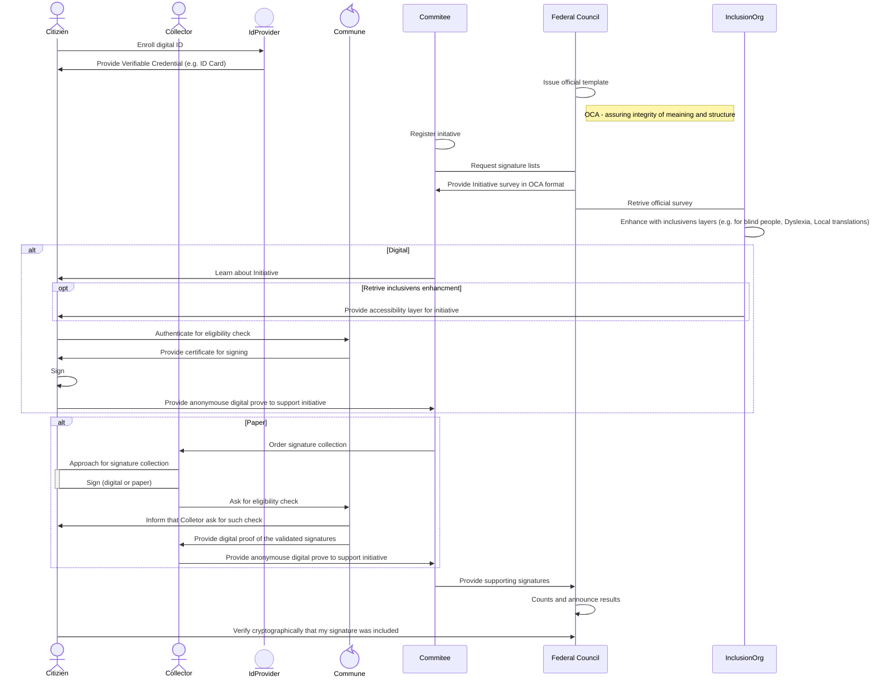
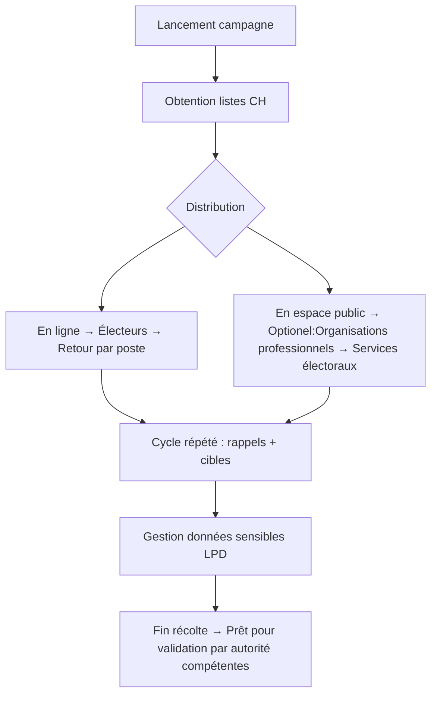

# Team 8. Instaurer la confiance à chaque signature ! Collecte électronique fédérée et vérifiée cryptographiquement

## Team 8 Contributeurs
| Membre  | Representant  | Organisation |
|---------|---------------|-------------|
| Philippe Page | *gouvernance distribuée* | [Human Colossus Foundation](https://humancolossus.foundation)|
| Robert Mitwicki | *technologies décentralisées* | [Human Colossus Foundation](https://humancolossus.foundation)|
| Jérôme Campese | *agence de récolte de signature* | [VOX Communication SA](https://www.vox-communication.ch/presentation) |
| Alessua Pacino | *canton de Thurgovie* | |
| Damian VIZÁR | *sécurité, cryptographie* | CSEM |
| Michał Pietrus | *identité numérique & cryptographie appliquée* | ArgonAuths |
  
### Références utilisées
1. [Hackathon Guidelines](https://www.bk.admin.ch/bk/de/home/politische-rechte/e-collecting/aktuelles.html) Chancellerie Fédérale
2. Overlays Capture Architecture [OCA](https://oca.colossi.network/) specification
3. Distributed Key Managment System [DKMS](https://dkms.colossi.network/) specification

## Approche

### 1. Introduction
Notre approche repose sur l’adaptation des processus réglementaires existants à une architecture décentralisée et vérifiable. 

Durant la durée du hackathon, nous avons intéragi avec les experts présnents avec les compétences suivantes :
- Modélisation de processus réglementaires
- Expérience des systèmes communaux et cantonaux
- citoyens intéressé à la numérisation des services publiques
- agent de récolte de signature

#### Présentation de l'approche en 4 minutes 
*(vendredi 31 octobre)*

### 2. Description synthétique

Notre solution vise à mettre en place une architecture décentralisée permettant à chaque acteur du processus de E-Collecting d'intéragir sans la nécessité d'une plateforme unique. Cette approche vise une intégration des systèmes des acteurs légitimes plutôt que la creation de platform ou registres centralisé qui créent des dépendences envers différents acteurs technologiques, un risque de hacking (honey pot), et des coûts de déploiment.

Cette architecture s'appuie sur les architectures open source [DKMS](https://dkms.colossi.network/) (Decentralised Key Management System) et [OCA](https://oca.colossi.network/) v2.0 (Overlays Capture Architecture), développées par la [Human Colossus Foundation](https://humancolossus.foundation/). Ces deux architectures sont particulièrement bien adaptées pour numériser et sécuriser les processus civiques tout en garantissant l'interopérabilité, la transparence et la vérifiabilité.

Nous proposons une approache par *petits pas significatifs* afin de s'assurer que l'évolution des normes (e.g. nombre de signatures à récolter) puisse s'adapter aux progrès technologiques.

| Phase  | But  | Description |
|---------|---------------|---- |
|1  |Numérisation essentielle| Le status quo n'est pas une option. Cette première phase, à mettre en place rapidement, se concentre donc sur les point clefs et introduit **une signature numérique pour le citoyen** et **améliore l'efficacité des contrôles**  tout en préservant le role des communes, cantons, comité d'initiatives et Chancellerie Fédérale.|
|2  |Feedback loop| Mesure de l'adoption des nouveautés et mesure de l'impact sociétal. *Ce sujet, bien que discuté durant le hackathon, n'est pas abordé ici*|
|3  |DDPI| Intégration du E-Collecting dans le concept plus large the Democratic Digital Public Infrastructure (DDPI). *Hors sujet pour le hackathon* |

Selon l'approche ci-dessus, seule la phase 1, **Numérisation essentielle** est inclue dans le champ de notre solution pour le hackathon.

### Originalité de la solution: Authenticité et Intégrité *by-design*
We introduce a protocole based approach where open-source protocoles are intégrated in the different components of an E-Collecting system.
#### Documentation and Diagrams
Over the course of 2 days hackathon we worked with all [stakeholders](#sequence-diagram-details-des-interactions--flux-de-données) to reflect their requirments, governance and limitations.

Below sequence diagram present possible scenario showcase how propsed architecture could improve e-collecting process, few highlights presented on the below diagram:
- Anonymity and linkability are the two main characteristics to consider when securing and protecting citizen privacy. Linkability is only needed between citizens and the commune, while anonymity should be in place for any other actors, who should not be able to discover citizen identity. This is especially important for the Federal Council when counting votes.
- It is assumed that the authentication (identification) process between the commune and citizen can be carried out using various ID providers (SwissPass, Swiss e-ID, passport, SwissSign, etc.). After this, the commune can issue a `one-time certificate` that can be used to digitally sign that specific initiative. This ensures that the citizen will not be linked in the subsequent stages of the process, while maintaining the audibility and cryptographic provability of the entire process.
- Introduce an additional notification mechanism to inform citizens about eligibility checks and signatures included in initiatives. This increases transparency and allows citizens to regain trust in the digital system. If someone tries to 'steal' their signature, they will at least be informed.
- Thanks to `DKMS`, we can establish distributed (digital) governance around the ecosystem and designate different parties which can be verified (as well as all the objects e.g. survey with content) during the process, for example:
  - Inclusive organisations, who can enrich existing initiatives with additional layers, e.g. local translation, improved text for people with ADHD, improved reading materials for blind people, and so on.
  - Collectors, so citizens can verify whether a collector is authorised to collect votes.
  - ID providers
  - Verify that the content which citizens are signing is actually registered for the initiative.
- The protocol-based approach enables each actor to define their own rules, facilitating integration with existing IT systems and reducing the costs and complexity of e-collection. This is particularly important in the context of various registries used to verify citizens and different parties within the ecosystem.

### Originalité de la solution: Gouvernance Distribuée *by-design*
#### Étape 1 : Cas d’usage — Collecte de signatures en milieu physique
Nous modélisons et implémentons la numérisation du processus de collecte de signatures, en intégrant :
- Numérisation de la collecte de signature dans la rue
- La vérification en temps réel des signatures électroniques
- La complémentarité avec les solutions "papier"

#### Étape 2 : "Trust but Verify" Analyse des 10 thèmes du Hackathon
Nous évaluons chaque thème en identifiant :
- Les avantages apportés par notre solution (transparence, traçabilité, inclusion)
- Les risques potentiels (accessibilité, adoption, conformité réglementaire)
- Une analyse de risque des technologies numériques (e.g. anonymity, linkability)

Objectifs de ces deux étapes :
1. Démontrer la faisabilité d’une solution civique basée sur des protocoles ouverts et décentralisés
2. Mettre en évidence les bénéfices concrets par rapport aux systèmes papier ou centralisés
3. Révéler des fonctionnalités exclusives à la version numérique — notamment, une preuve de comptage de signatures accessible au citoyen

## Approach
### 1. Introduction
Our approach is based on adapting existing regulatory processes to a decentralized and verifiable architecture. For more details, see our full documentation (to be completed) and any deliverables already produced (if applicable).

We are seeking contributors with skills in:
- Modeling regulatory processes
- Experience with municipal and cantonal systems
- Citizens interested in the digitization of public services
  
### 2. Summary Description
Our solution leverages the open-source architectures [DKMS](https://dkms.colossi.network/) (Decentralised Key Management System) and [OCA](https://oca.colossi.network/) v2.0 (Overlays Capture Architecture), developed by the [Human Colossus Foundation](https://humancolossus.foundation/), to digitize and secure civic processes while ensuring interoperability, transparency and verifiability.

#### Step 1: Use Case — Steeet Signature Collection
We model and implement the digitization of the signature collection process, integrating:
- Digitization of signature collection in the street
- Real-time verification of electronic signatures by all actors
- Complementarity with “paper” solutions

#### Step 2: Analysis of the 10 Hackathon Themes
We evaluate each theme by identifying:
1. Benefits provided by our solution (transparency, traceability, inclusion)
2. Potential risks (accessibility, adoption, regulatory compliance)
3. Objectives of these two steps:

Demonstrate the feasibility of a civic solution built on open, decentralized protocols
Highlight tangible benefits compared to paper-based or centralized systems
Reveal features exclusive to the digital version — notably, citizen-accessible proof of signature count

###  Desciption générale des processus selon la réglementation en vigeure
### 1 Lancement D'initiative populaires et demande de référendum
*à faire*

### 2 Collecte des signature
#### Flow chart

#### Sequence Diagram: Details des interactions & Flux de données
Le processus de collecte des signatures pour les initiatives et les référendums est décrit dans le rapport du Conseil fédéral (réf. AAA).
Il implique les acteurs suivants :
| 🎯 Acteur                      | 📝 Description                                                                 | 📜 Base légale / Notes                                     | 🛠️ Responsabilités dans la phase de récolte             |
|-------------------------------|--------------------------------------------------------------------------------|------------------------------------------------------------|----------------------------------------------------------|
| **Comité**                    | Comité lançant l’initiative populaire ou la demande de référendum. Gère la campagne, la logistique et le traitement des données. | Art. 60a, 69a LDP (listes) ; LPD Art. 5c (protection des données) | Diffuser les listes, engager des collecteurs, respecter la finalité des données |
| **Électeurs**                 | Citoyens suisses qui signent les listes. Leurs données sont sensibles selon la LPD. | LPD Art. 5c (données sensibles) ; principe de finalité     | Renvoyer les listes signées (par la poste ou en personne) |
| **Organisations professionnelles**         | Organismes professionnels engagés pour récolter des signatures ou obtenir des attestations. | En cours de réglementation (soupçons de falsification)      | Récolter en espace public ; obtenir les attestations d’électeur |
| **Chancellerie fédérale (CH)** | Autorité fédérale qui met à disposition les listes de signatures téléchargeables. | Art. 60a, 69a LDP                                          | Fournir les formulaires — *non impliquée dans la récolte* |
| **Services électoraux**       | Services cantonaux ou communaux gérant les registres électoraux.               | Droit cantonal (vérification de l’éligibilité)             | Délivrer les attestations d’électeur aux collecteurs     |
| **Cantons/Communes (CC)**     | Autorités locales régulant l’utilisation de l’espace public pour la récolte.   | Droits fondamentaux (Art. 5, 10, 35 Cst.)                  | Autoriser l’utilisation de l’espace public sous conditions |

**Diagramme de séquences**

## User Experience

Although our approach does not directly address UX, it has a significant impact on UX design. This is because the protocol-based approach enables the development of applications or integrations tailored to the specific needs of each stakeholder without compromising interoperability. For instance, an independent organisation could develop a referendum app tailored to blind people, enabling them to participate in the initiative more easily. Similarly, people unable to sign could use a dedicated application with facial recognition for identification purposes, reducing barriers to participation. The SMPT protocol has also enabled various solutions for email clients and servers on the internet, and DKMS does the same here. This allows the creation of a rich, stable ecosystem that is resilient and can address the needs of all parties (with no vendor locking).

## Topics addressed
L'équipe 8 *Confiance pour chaque signature" abordéra les 10 thèmes présentés dans les [directives](https://www.bk.admin.ch/bk/de/home/politische-rechte/e-collecting/aktuelles.html). La table ci-dessous identifié l'approche:
- *Gouvernance:* Quelles règles définissent le système
- *Data:* Comment la définission et l'intégrité des données est-elle assurée.
- *Tech.:* Quelles inovations technologiques nous allons introduire
En fonction de l'avancement du hackathon, des liens seront ajouté pour donner plus de détails.

*Explain how you addressed the topics presented in the [guidelines](https://www.bk.admin.ch/bk/de/home/politische-rechte/e-collecting/aktuelles.html), filling in the template below.*

| Topic | (How) is it addressed? |c.f. Cas d'étude|
| -| ------- |---- |
| 1 « De la volonté de soutien à la déclaration de soutien »| *Gouvernance:* ...||
|| *Data:* ...||
||**Tech. perspective:** Authentication décentralisée||
| 2 « Accès aux informations concernant les déclarations de soutien déposées » | *Gouvernance:* ...||
|| *Data:* ...||
||**Tech. perspective:** ... ||
| 3 « Attribution des attestations de soutien aux comités et aux entreprises de récolte »| *Gouvernance:* ...||
|| *Data:* ...||
||**Tech. perspective:** ...  ||
| 4 « Diffusion des arguments des comités via le logiciel de récolte électronique de signatures » | *Gouvernance:* ...||
|| *Data:* ...||
||**Tech. perspective:** ...  ||
| 5 « Exclusion des attestations de soutien illicites »  |*Gouvernance:* ...||
|| *Data:* ...||
||**Tech. perspective:** ...   ||
| 6 « Prévention des attestations de soutien non dépouillées »  | *Gouvernance:* ...||
|| *Data:* ...||
||**Tech. perspective:** ...  ||
| 7 « Respect du secret du vote »  |*Gouvernance:* ...||
|| *Data:* ...||
||**Tech. perspective:** ...   ||
| 8 « Intégration avec le processus papier »  |*Gouvernance:* ...||
|| *Data:* ...||
||**Tech. perspective:** ...   ||
| 9 « Introduction facilitée pour les communes avec un gain d'efficacité ; sur la base des
infrastructures et des processus existants »  | *Gouvernance:* ...||
|| *Data:* ...||
||**Tech. perspective:** ...  ||
| 10 « Récolte électronique pour tous les niveaux fédéraux »  | *Gouvernance:* ...||
|| *Data:* ...||
||**Tech. perspective:** ...  ||

### 3 Vérification des signature et soumission à la Chancellerie Fédérale
*à faire*

## Points forts et faiblesses (*Key Strenghts and Weaknesses*)

*List the key strengths and weaknesses of your solution.*

### Points forts:
(*Key strenght*)
- ...
- ...

### Faiblesses:
(*Weaknesses*)
- ...
- ...

## Pilot

We suggest conducting a pilot with a consortium of stakeholders to demonstrate the benefits of the technology and identify any potential challenges that may arise during testing in the real world. The consortium should consist of:
- organisations that collect signatures on the streets
- an inclusivity organisation;
- at least two or more ID providers. 
- two or more communes.
- at least two cantons
- Cryptography experts
- IT providers of solutions for IT systems in communes/cantons (integration feasibility). 
- Federal Council

As initiatives are a very sensitive topic, we would suggest running a pilot in scope of collecting signatues for petition, which would give us the chance to prepare for a large-scale pilot of national initiatives. 

## Getting Started  

### Conditions préalables
*Ce dont vous avez besoin pour commencer.*
Nous formons une équipe multidisciplinaire. 
- Citoyen 
- Cantons et communes
- Initiateur d'une initiative / d'un référendum
- Chancellerie fédérale
- Développeur de solutions
La condition préalables principale est la volonté de poser des questions afin de construire une solution les prenant en compte.

## Contribution & Code de conduite
Veuillez lire [CONTRIBUTING.md](/CONTRIBUTING.md) pour plus de détails sur notre code de conduite.

## License

Tous les documents contenus dans ce référentiel sont soumis à une licence EUPL1.2. Pour plus d'informations, consultez le fichier [LICENCE](LICENCE).

Alle Materialien in diesem Repository unterliegen einer EUPL1.2-Lizenz – Einzelheiten finden Sie in der Datei [LICENSE](LICENSE).

Tutti i materiali presenti in questo archivio sono concessi in licenza ai sensi della licenza EUPL1.2. Per ulteriori dettagli, consultare il file [LICENZA](LICENZA).

Ĉiuj materialoj en ĉi tiu deponejo estas licencitaj laŭ EUPL1.2-licenco - vidu la dosieron [LICENSE](LICENSE) por detaloj.

All materials under this repository is licensed under a EUPL1.2 License - see the [LICENSE](LICENSE) file for details.

