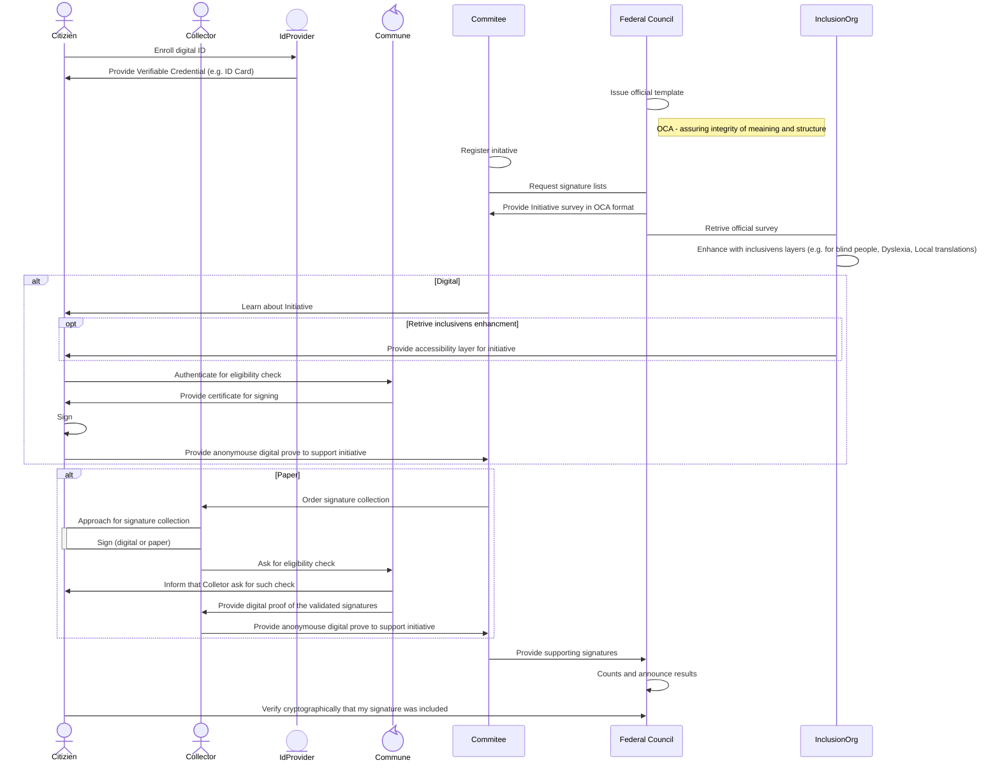
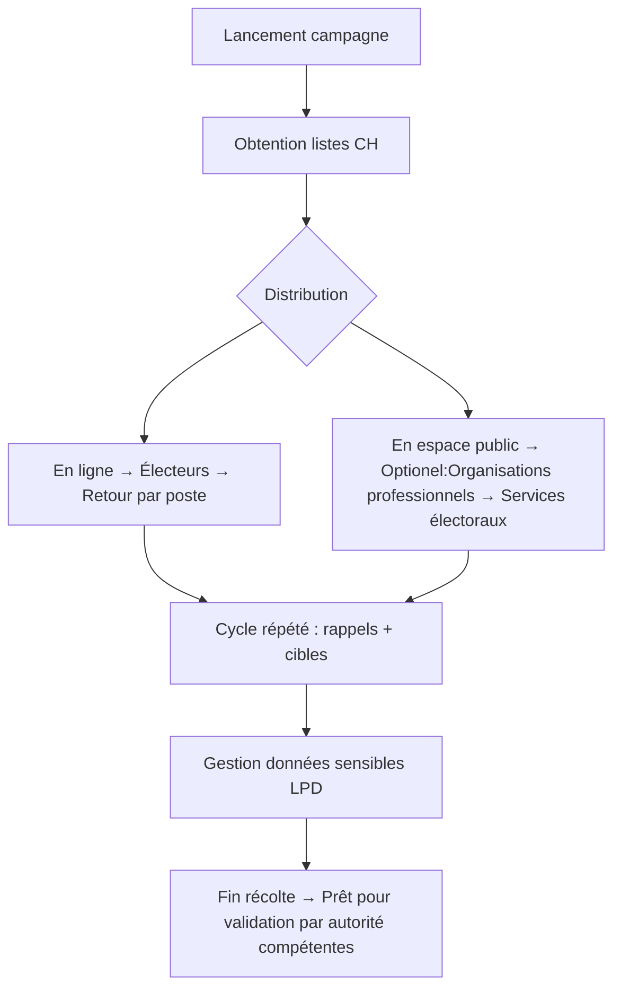

# Team 8. Build trust with every signature! Federated and cryptographically verified electronic collection
*(une version francaise est [ici](https://github.com/the-human-colossus-foundation/e-collecting-hackathon-team8/blob/main/README.md))*
## Team 8 Contributors
| Member  | Expertise  | Organisation |
|---------|---------------|-------------|
| Philippe Page | *distributed governance* | [Human Colossus Foundation](https://humancolossus.foundation)|
| Robert Mitwicki | *decentralised technologies* | [Human Colossus Foundation](https://humancolossus.foundation)|
| Jérôme Campese | *signature collection agency* | [VOX Communication SA](https://www.vox-communication.ch/presentation) |
| Alessua Pacino | *canton of Thurgau* | |
| Damian VIZÁR | *sécurity, cryptography* | CSEM |
| Michał Pietrus | *digital identity & applied cryptography* | ArgonAuths |
  
### References
1. [Récolte électronique des signatures à l'appui des initiatives populaires et des demandes de référendum au niveau fédéral](https://www.newsd.admin.ch/newsd/message/attachments/90668.pdf), Rapport du Conseil Fédéral, Novembre 2023
2. [Hackathon Guidelines](https://www.bk.admin.ch/bk/de/home/politische-rechte/e-collecting/aktuelles.html) Chancellerie Fédérale
3. Overlays Capture Architecture [OCA](https://oca.colossi.network/) specification
4. Distributed Key Managment System [DKMS](https://dkms.colossi.network/) specification

## Approach
### 1. Introduction
Our approach is based on adapting existing regulatory processes to a decentralised and verifiable architecture. 

During the hackathon, we interacted with experts with the following skills:
- Modelling of regulatory processes
- Experience with municipal and cantonal systems
- Citizens interested in the digitisation of public services
- Signature collection agents

#### Presentation of the approach in 4 minutes

### 2. Summary description: Federated and independent approach based on a single platform

#### Scope of the Hackathon: Phase 1
We propose a *small but significant steps* approach to ensure that changes to standards (e.g. number of signatures to be collected) can be adapted to technological progress.

| Phase  | Goal  | Description |
|---------|---------------|---- |
|1  |Essential digitisation | The status quo is not an option. This first phase, to be implemented rapidly, therefore focuses on key points and introduces **a digital signature for citizens** and **improves the efficiency of controls**  while preserving the role of municipalities, cantons, initiative committees and the Federal Chancellery.|
|2  |Feedback loop| Measuring the adoption of new developments and measuring societal impact. *This topic, although discussed during the hackathon, is not addressed here.*|
|3  |DDPI| Integration of E-Collecting into the broader concept of the Democratic Digital Public Infrastructure (DDPI). *Not relevant to the hackathon* |

According to the above approach, only phase 1, **Essential Digitisation**, is included in the scope of our solution for the hackathon.

#### Protocols for data integrity and authenticity
Our solution aims to establish a decentralised architecture enabling each participant in the e-collecting process to interact without the need for a single platform. This approach aims to integrate the systems of legitimate participants rather than creating centralised platforms or registers that create dependencies on different technology providers, a risk of hacking (honey pot), and deployment costs. Two innovations are described below:

A. Authenticity & Integrity by Design
B. Distributed Governance

#### Documentation and Diagrams
#### A Authenticité et Intégrité *by-design*
We introduce a protocole based approach where open-source protocoles for authentication and data integrity are intégrated in the different components of an E-Collecting system. Collectively, they enable a digital verification architecture that can be used by any stakeholders in the process. 

This architecture is based on two open source components [DKMS](https://dkms.colossi.network/) (Decentralised Key Management System) for the authentication and [OCA](https://oca.colossi.network/) v2.0 (Overlays Capture Architecture), developed by the [Human Colossus Foundation](https://humancolossus.foundation/) for data integrity and harmonisation. These are two architectures are particularly well suited to digitising and securing civic processes while ensuring interoperability, transparency and verifiability.

The following diagramme describes how these architectures integrate into an E-Collecting system from identification of a stakeholder up to the specific applications/integration.

The technology stack (left column) rests on a digital identifiers layer that assumes multiple providers. The **"Identity Provider"** layer provide flexibility to integrate different mechanisms for identification depending on the use case. An example discussed during the hackathon refers to the *accessibility* where the identification for visually impaired individual will require specific mechanisms (e.g. biometric).

The **Protocol Layer** ensure security and harmonisation across the different authentication methods. 

The **Governance** layer is where the purpose of the use case is defined in terms of actors and data flows. In the Hackathon, we considered on specific use case of the E-Collection in the street as a benchmark use case. Other use cases can be developed without changing the underlying layers. This approach ensures interoperability between use cases and is well suited for a "Program Approach" where multiple projects can be developed independently. During the Hackathon, the case of applying E-Collecting for cantonal petition was elaborated for example.

The **Application Layer** is where the UX/UI is developed according to the use case defined in the Governance Layer. This ensures that context dependent application can be developed with the assurance that each is secured through the same governance and rest on the same authentication and integrity protocols. This approach has a significant cost impact as the security of the the system in terms of authentication and integrity is in the protocol and does not need to be redeveloped at the application layer. In technical terms, the approach is a paradigm shift from *Fat Application on Thin Protocols* to *Thin Application to Fat Protocols*

The architecture above provide a flexible framework to handel **Anonymity** and **Linkability**, the two main characteristics to consider when securing and protecting citizen privacy. It is well know that trade off between the two often occur. Within our layered approach, the two characteristics can be considered with a specific context. For E-Collecting, linkability is only needed between citizens and the commune. Anonymity between citizen and his commune reduces to the commune not recording the citizen support to an initiative/referandum longer than the strict minimum required. On the other hand anonymity should be in place for any other actors, who should not be able to discover citizen identity.  This is especially important for the Federal Council when counting votes.

Over the course of 2 days hackathon we worked with all [stakeholders](#sequence-diagram-details-of-interactions--data-flows) to reflect their requirments, governance and limitations. Below sequence diagram present possible scenario showcase how propsed architecture could improve e-collecting process, few highlights presented on the below diagram:

- Authentication (identification) process between the commune and citizen can be carried out using various ID providers (SwissPass, Swiss e-ID, passport, SwissSign, etc.). After this, the commune can issue a `one-time certificate` that can be used to digitally sign that specific initiative. This ensures that the citizen will not be linked in the subsequent stages of the process, while maintaining the audibility and cryptographic provability of the entire process.
- Introduction of additional notification mechanisms to inform citizens about eligibility checks and signatures included in initiatives. This increases security transparency and allows citizens to regain trust in the digital system. If someone tries to 'steal' their signature, they can opt-in a notification mechanism can informed them.
- `DKMS` to establish a distributed (digital) governance around the ecosystem and designate different parties which can be verified (as well as all the objects e.g. survey with content) during the process, for example:
  - Inclusive organisations, who can enrich existing initiatives with additional layers, e.g. local translation, improved text for people with ADHD, improved reading materials for blind people, and so on.
  - Collectors, so citizens can verify whether a collector is authorised to collect votes.
  - ID providers
  - Verify that the content which citizens are signing is actually registered for the initiative.
- The protocol-based approach enables each actor to define their own rules, facilitating integration with existing IT systems and reducing the costs and complexity of e-collection. This is particularly important in the context of various registries used to verify citizens and different parties within the ecosystem.

#### E-Signature in the street use case
We model and implement the digitization of the signature collection process, integrating:
- Digitization of signature collection in the street
- Real-time verification of electronic signatures by all actors
- Complementarity with “paper” solutions
Demonstrate the feasibility of a civic solution built on open, decentralized protocols
Highlight tangible benefits compared to paper-based or centralized systems
Reveal features exclusive to the digital version — notably, citizen-accessible proof of signature count

#### Collection process & artifacts.
The use case is describe in terms that will allow an in depth security analysis. These Hackaton notes sketches a notion of a scheme for electronic collection of signatures in supporting a referendum or an initiative.

The objective of such notion is to help define clear security requirements and assumptions, as well as to facilitate security analysis.

#### Notation
Parties denoted with **boldface**.
Artifacts denoted with *italics*.

#### Parties
1. **Committee**: Initiaties an initiative with the objective of collecting enough signatures to support it. 
2. **Chancellerie**: Validates the initiative, counts the signatures, attests the end result.
3. **Collectors**: Mandated by the Committee to collect signatures
4. **Voters**: Give their signatures to support the initiative
5. **Commune**: Verifies signatures (i.e. Voters eligibility) and ensures each Voter contributes at most once 

In addition, all parties except **Voters** have internal employees, denoted **XXX.Emp** where **XXX** is the party in question. The party **Commune** conflates Canton/Commune/Electoral committee for simplicity.

#### Process
In each party **XXX** with employees, each **XXX.Emp** that intervenes on an internal process of **XXX** receives a *Mandate* from **XXX**. The mandate may be role based, or task-based (a role specific to the initiative/batch of signatures etc.).

1. **Committee**: Creates and authenticates *Initiative* 
    * **Committee.Emps** contribute to the Initiative
2. **Chancellerie**: Verifies, approves and authenticates the  *Initiative*
    * Concrete **Chancellerie.Emps** perform the verification
3. **Committee**: Mandates **Collectors**  with the collections of *Support signatures* for the *Initiative* 
    * Inidividual mandates are issued by **Committee.Emps**
4. **Collectors**: Collect *Support signatures* for the *Initiative* from **Voters** and transfer them to **Committee**
    * Individual *Support signatures* are collected by concrete **Collector.Emps**
5. **Committee**: Send collected *Support signatures* to **Commune** for verification, in order to obtain *Signature certificates*
    * Verification and processing of signature (batches) could be performed by individual **Commune.Emps** but possibly also automatized
6. **Committee**: Obtains *Signature certificates* from the **Commune** and keeps track of the total count
7. **Chancellerie**: Obtains all collected *Signature certificates* from **Committee**, verifies them and if the count is sufficient, issues a *Confirmation of the initiative success*.
    * Verification and processing of signature (batches) could be performed by individual **Chancellerie.Emps** but possibly also automatized

#### Artifacts
The artifacts highlighted in the process may be constructed in many ways, depending on the construction. Additional, auxiliary artifacts may be used if needed, but those above shall be embodied in any distributed construction that aligns with the existing governance structures and procedures.
1. *Initiative*: Initiative for which **Voters** support is asked.
2. *Support signatures*: Set of support of **Voters** including mandatory attributes (name, address,signature,...) for each **Voters**. Support is collected asynchronously and are bundled together. **Commune** is the atomic unit (i.e. each signature list contains individual signatures of the same **Commune**
3. *Signature certificates*: Certifies the eligibility and unicity of individual **Voters** in one or more *Support signatures* of a specific **Commune**
4. *Confirmation of the initiative success*: is the certificate issued by the Chancellor in case of success. This artifact, or its absence after a define time limit, triggers sub-processes (e.g.  *Support signatures* destruction, launch popular vote) that terminate the support signature collection process.

The process is represented in the following sequence diagramme

A preliminary draft of a security analysis is provided [here for illustration purposes](https://github.com/the-human-colossus-foundation/e-collecting-hackathon-team8/blob/main/docs/SecurityAnalysis_v01.pdf).

#### B.Distributed Governance *by-design*
For the Governance Layer, we apply a digital distributed governance model that avoids the need of creating a centralised platform outside the control of a legitimate authority (e.g no data stored unless already provision in the law). 

A very simplified flow chart is

#### Sequence Diagram: Details of interactions & Data flows
The process of collecting signatures for initiatives and referendums is described in the Federal Council report (ref. AAA).
It involves the following actors:
| 🎯 Actor                      | 📝 Description                                                                 | 📜 Legal Basis / Notes                                     | 🛠️ Responsibility in signature collection             |
|-------------------------------|--------------------------------------------------------------------------------|------------------------------------------------------------|----------------------------------------------------------|
| **Committee**                    | Committee launching the popular initiative or referendum request. Manages the campaign, logistics and data processing. | Art. 60a, 69a LDP (lists); LPD Art. 5c (data protection) | Distribute lists, hire collectors, respect the purpose of the data |
| **Voters**                 | Swiss citizens who sign the lists. Their data is sensitive according to the DPA. | DPA Art. 5c (sensitive data); principle of purpose     | Return the signed lists (by post or in person) |
| **Collectors**         | Professional organisations involved in collecting signatures or obtaining certificates. | Currently being regulated (suspected falsification)      | Collecting in public spaces; obtaining voter certificates |
| **Federal Chancellery** |  Federal authority that makes the signature lists available for download. | Art. 60a, 69a LDP                                          | Provide forms — *not involved in collection* |
| **Electoral Committee**       | Cantonal or municipal services managing electoral registers.               | Cantonal law (verification of eligibility)             | Issuing voter certificates to collectors     |
| **Cantons/Communes**     | Local authorities regulating the use of public space for harvesting.   | Fundamental rights (Art. 5, 10, 35 Cst.)                  | Authorise the use of public space under certain conditions |

**Sequence Diagram**

## User Experience
Although our approach does not directly address UX, it has a significant impact on UX design. This is because the protocol-based approach enables the development of applications or integrations tailored to the specific needs of each stakeholder without compromising interoperability. For instance, an independent organisation could develop a referendum app tailored to blind people, enabling them to participate in the initiative more easily. Similarly, people unable to sign could use a dedicated application with facial recognition for identification purposes, reducing barriers to participation. The SMPT protocol has also enabled various solutions for email clients and servers on the internet, and DKMS does the same here. This allows the creation of a rich, stable ecosystem that is resilient and can address the needs of all parties (with no vendor locking).

## Topics covered
Team 8, ‘Trust for every signature’, addressed the 10 topics presented in the [guidelines](https://www.bk.admin.ch/bk/de/home/politische-rechte/e-collecting/aktuelles.html). The table below outlines the approach:
- *Governance:* What rules define the system?
- *Data:* How is data definition and integrity ensured?
- *Tech.:* What technological innovations will we introduce?

| Topic | (How) is it addressed? |c.f. Cas d'étude|
| -| ------- |---- |
| 1 « De la volonté de soutien à la déclaration de soutien »| *Gouvernance:* ...||
|| *Data:* ...||
||**Tech. perspective:** Authentication décentralisée||
| 2 « Accès aux informations concernant les déclarations de soutien déposées » | *Gouvernance:* ...||
|| *Data:* ...||
||**Tech. perspective:** ... ||
| 3 « Attribution des attestations de soutien aux comités et aux entreprises de récolte »| *Gouvernance:* ...||
|| *Data:* ...||
||**Tech. perspective:** ...  ||
| 4 « Diffusion des arguments des comités via le logiciel de récolte électronique de signatures » | *Gouvernance:* ...||
|| *Data:* ...||
||**Tech. perspective:** ...  ||
| 5 « Exclusion des attestations de soutien illicites »  |*Gouvernance:* ...||
|| *Data:* ...||
||**Tech. perspective:** ...   ||
| 6 « Prévention des attestations de soutien non dépouillées »  | *Gouvernance:* ...||
|| *Data:* ...||
||**Tech. perspective:** ...  ||
| 7 « Respect du secret du vote »  |*Gouvernance:* ...||
|| *Data:* ...||
||**Tech. perspective:** ...   ||
| 8 « Intégration avec le processus papier »  |*Gouvernance:* ...||
|| *Data:* ...||
||**Tech. perspective:** ...   ||
| 9 « Introduction facilitée pour les communes avec un gain d'efficacité ; sur la base des
infrastructures et des processus existants »  | *Gouvernance:* ...||
|| *Data:* ...||
||**Tech. perspective:** ...  ||
| 10 « Récolte électronique pour tous les niveaux fédéraux »  | *Gouvernance:* ...||
|| *Data:* ...||
||**Tech. perspective:** ...  ||

## Key Strenghts and Weaknesses

### Key strenght
- Data Security. Decentralised protocols secure data
- ...

### Weaknesses
- ...
- ...

## Pilot

We suggest conducting a pilot with a consortium of stakeholders to demonstrate the benefits of the technology and identify any potential challenges that may arise during testing in the real world. The consortium should consist of:
- organisations that collect signatures on the streets
- an inclusivity organisation;
- at least two or more ID providers. 
- two or more communes.
- at least two cantons
- Cryptography experts
- IT providers of solutions for IT systems in communes/cantons (integration feasibility). 
- Federal Council

As initiatives are a very sensitive topic, we would suggest running a pilot in scope of collecting signatues for petition, which would give us the chance to prepare for a large-scale pilot of national initiatives. 

## License

Tous les documents contenus dans ce référentiel sont soumis à une licence EUPL1.2. Pour plus d'informations, consultez le fichier [LICENCE](LICENCE).

Alle Materialien in diesem Repository unterliegen einer EUPL1.2-Lizenz – Einzelheiten finden Sie in der Datei [LICENSE](LICENSE).

Tutti i materiali presenti in questo archivio sono concessi in licenza ai sensi della licenza EUPL1.2. Per ulteriori dettagli, consultare il file [LICENZA](LICENZA).

Ĉiuj materialoj en ĉi tiu deponejo estas licencitaj laŭ EUPL1.2-licenco - vidu la dosieron [LICENSE](LICENSE) por detaloj.

All materials under this repository is licensed under a EUPL1.2 License - see the [LICENSE](LICENSE) file for details.
