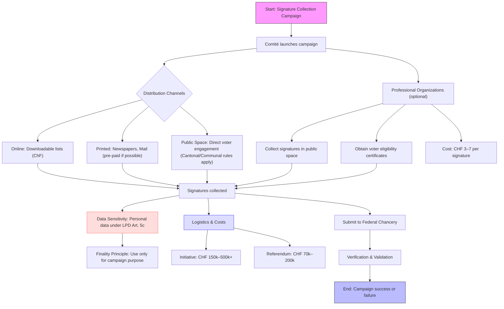

The process for signatures collections for initatives and referandum is described from the Federal Council report (ref. AAA).
It involves the following actors:

```mermaid

graph TD
    A["Start: Signature Collection Campaign"] --> B["Comité launches campaign"]
    B --> C{"Distribution Channels"}
    C --> D["Online: Downloadable lists (ChF)"]
    C --> E["Printed: Newspapers, Mail (pre-paid if possible)"]
    C --> F["Public Space: Direct voter engagement (Cantonal/Communal rules apply)"]
    
    B --> G["Professional Organizations (optional)"]
    G --> H["Collect signatures in public space"]
    G --> I["Obtain voter eligibility certificates"]
    G --> J["Cost: CHF 3–7 per signature"]
    
    D & E & F & H & I --> K["Signatures collected"]
    K --> L["Data Sensitivity: Personal data under LPD Art. 5c"]
    L --> M["Finality Principle: Use only for campaign purpose"]
    
    K --> N["Logistics & Costs"]
    N --> O["Initiative: CHF 150k–500k+"]
    N --> P["Referendum: CHF 70k–200k"]
    
    K --> Q["Submit to Federal Chancery"]
    Q --> R["Verification & Validation"]
    R --> S["End: Campaign success or failure"]
    
    style A fill:#f9f,stroke:#333
    style S fill:#bbf,stroke:#333
    style L fill:#fdd,stroke:#f66
    style N fill:#ddf,stroke:#33f

```
